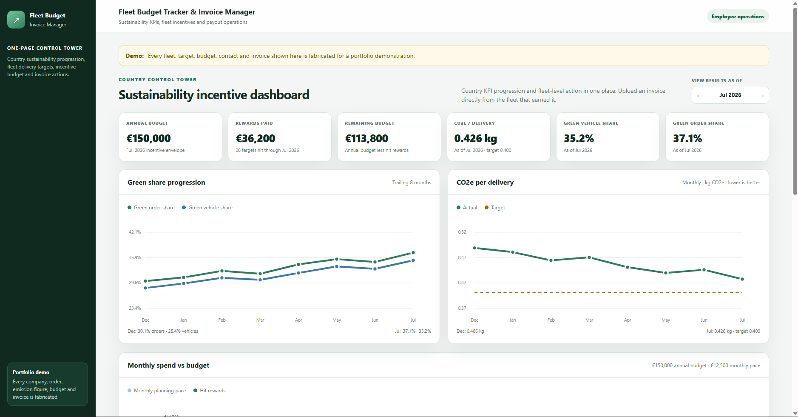
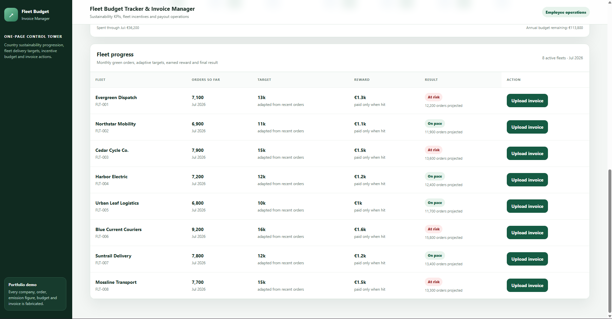
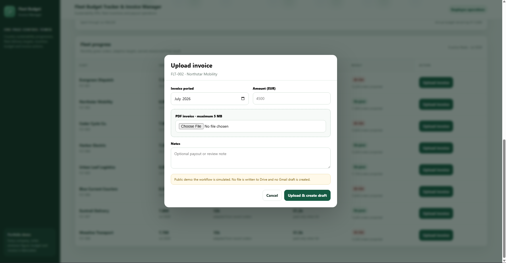

# Fleet Budget Tracker & Invoice Manager

A lightweight operations tool for tracking sustainability KPIs, managing fleet incentive budgets and handling invoice administration in one place.

> **Data disclaimer:** everything in this repo is fake and was created only for this portfolio project. The fleets, countries, targets, budgets, contacts, orders, emissions figures and invoices are all synthetic. There is no employer data, production credential or real invoice here.

## Live demo

**[Open the Fleet Budget Tracker & Invoice Manager](https://script.google.com/macros/s/AKfycbxmWk_dUmkK7xe9WsJWvMlKRuxlU8fqBxqZoiiCNasnCw4KR2Exg7Snc7mZXXn1bTcZVQ/exec)**

The public version is a safe demo. You can explore the dashboard and go through the invoice flow, but it does not write files to Google Drive or create real Gmail drafts.

## Preview

### Dashboard overview



The main dashboard brings together the annual budget, rewards paid, remaining budget, sustainability KPIs and recent trends in one view.

### Fleet progress



The fleet table shows current orders, adaptive targets, expected rewards, performance status and the invoice action for each fleet.

### Invoice workflow



From the relevant fleet row, an employee can add the invoice period, amount, PDF and an optional note. In a normal internal setup, the file is stored in the correct fleet Drive folder and a Gmail draft is prepared for review.

## Why I built it

The idea was to bring together a few things that are often managed separately:

- sustainability KPIs;
- fleet targets;
- budget tracking;
- reward calculations;
- invoice collection;
- document filing;
- payout communication.

When these live in different spreadsheets and folders, it becomes very easy to lose time, duplicate work or miss something.

This project puts the main workflow into one simple app.

## What it tracks

- CO2e emissions per delivery by country
- green-vehicle share
- green-order share
- interactive KPI charts
- an eight-month rolling trend view
- previous and next month controls
- annual programme budget and remaining balance
- monthly pace versus rewards triggered
- fleet targets based on recent order volume
- reward calculations
- current and completed month results
- invoice status and payout readiness

For this demo, a green order means an order completed with a bicycle, e-bike, electric scooter or electric car. That is just the rule used for this project, not a universal environmental claim.

## Invoice workflow

In a normal internal setup, an employee uploads an invoice from the relevant fleet row.

The app then:

1. checks the invoice details and PDF;
2. finds or creates the correct fleet folder in Google Drive;
3. renames and stores the file using a clear timestamped naming format;
4. adds the invoice to the tracking register;
5. creates a Gmail draft addressed to the company's invoice-processing mailbox, with the invoice attached and the fleet, period and amount already included.

The email stays as a draft, so someone can review the recipient, amount, period and attachment before sending it.

In the public demo, this flow is simulated. No file is saved to Drive and no Gmail draft is created.

## Architecture

```text
Employee web app
  ├─ sustainability KPI dashboard
  ├─ fleet progress and budget tracking
  └─ invoice upload and history
          |
          v
Google Apps Script backend
  ├─ KPI and budget calculations
  ├─ demo / internal mode switch
  ├─ Drive folder and file handling
  └─ Gmail draft creation
          |
          v
Google Sheets datastore
```

## What this could improve in a real team

This type of tool could help:

- reduce manual spreadsheet work;
- make budget status easier to understand;
- keep target and reward calculations consistent;
- connect performance tracking with invoice processing;
- keep invoices organised in the right Drive folders;
- prepare emails faster;
- keep a human review step before anything is sent;
- create a clearer record of the full workflow.

## How I built it

I used Claude and Claude Code agents in Cursor to help me build the project faster.

I defined the business problem, KPI logic, budget rules, user flow, invoice process and testing criteria. I then used AI to help with implementation, debugging, testing and documentation.

The AI helped me move faster, but I still made the decisions, reviewed the code and tested the final workflow myself.

## Repository structure

| File | What it does |
|---|---|
| `Code.gs` | Data setup, API methods, KPI calculations, budget logic, Drive handling and Gmail draft creation |
| `Index.html` | Main employee dashboard and invoice workflow |
| `Admin.html` | Fallback invoice uploader for employees |
| `appsscript.json` | Apps Script runtime settings and OAuth scopes |

## Tech stack

- Google Apps Script
- Google Sheets
- Google Drive
- Gmail drafts
- HTML, CSS and JavaScript
- SVG charts with interactive hover values

## Run your own copy

1. Create a blank Google Sheet.
2. Open **Extensions → Apps Script**.
3. Add the files from this repo.
4. Run `setupSyntheticProject` once.
5. Deploy the project as a web app.
6. Keep `MODE: 'portfolio_demo'` for a public, non-persistent demo.
7. Change it to `MODE: 'internal'` only for a properly restricted internal deployment.

## How I would connect it in production

The fake Sheet works well for a portfolio demo, but I would not use it as the main source of truth in a real company.

A production version should pull delivery, vehicle, fleet and payout data from the company's existing warehouse or database.

```text
Operational systems
  └─ orders, vehicles, fleets and payouts
          |
          v
Company warehouse or database
  └─ Snowflake, Redshift, Athena/S3, RDS, etc.
          |
          v
Scheduled transformation
  └─ validated fleet IDs, monthly KPIs and reward eligibility
          |
          v
Dashboard data layer
  └─ Google Sheet for a lightweight rollout, or a database/API at scale
          |
          v
Employee web app
```

That would make it easier to:

- refresh the data automatically;
- keep fleet IDs and vehicle types consistent;
- correct historical data;
- audit why a fleet was marked Hit or Miss;
- control access outside the spreadsheet;
- scale beyond Google Sheets.

Jira or monday.com could still be useful for workflow data, but delivery volume, vehicle type and emissions KPIs should ideally come from the company's governed data platform.

## Current limitations

- Google Sheets is fine for a lightweight demo, but not for large-scale production use.
- The public demo does not save invoices or create Gmail drafts.
- It does not connect to a real warehouse, invoice mailbox or Drive structure.
- Internal mode would need restricted access and the correct Google Workspace permissions.
- A real deployment would also need monitoring, retention rules, privacy review and financial-process approval.
- At larger scale, I would move the backend to a dedicated database or API.
